# 🪶 Sasquatch-Dotfile

Dotfiles personnels — **Hyprland** sur **Arch Linux**. Thème **adaptatif** (le wallpaper pilote toutes les couleurs), immersion **japonaise**, panneaux **Quickshell** faits main.

---

## 📸 Galerie

### 🎨 Thème adaptative (v2)

Le fond d'écran décide de la palette — barre, terminal, notifications, verrouillage, tout suit.

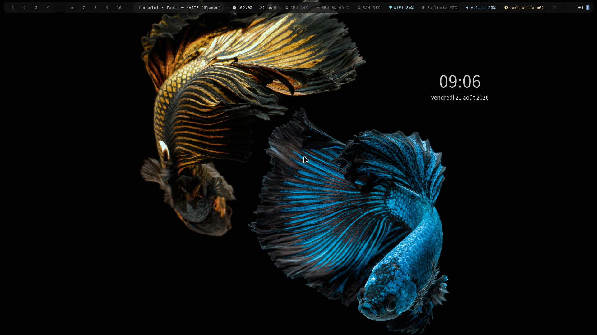
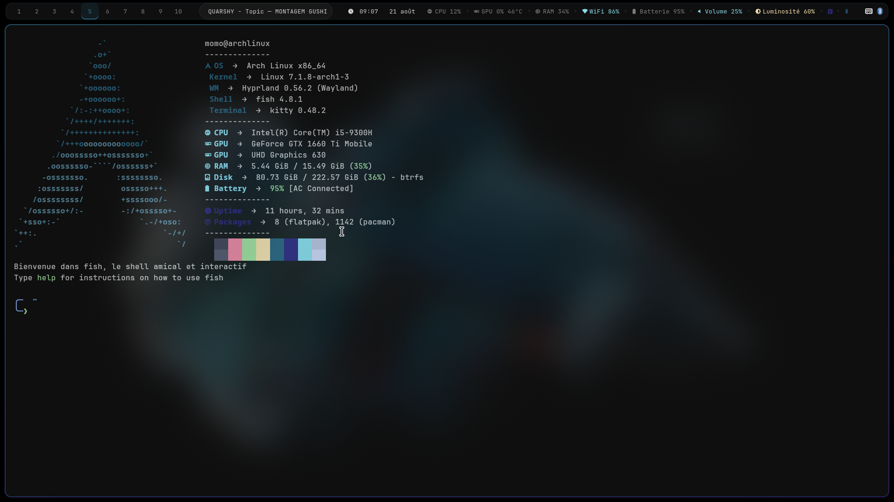

### 🧡 Ambiance ambre

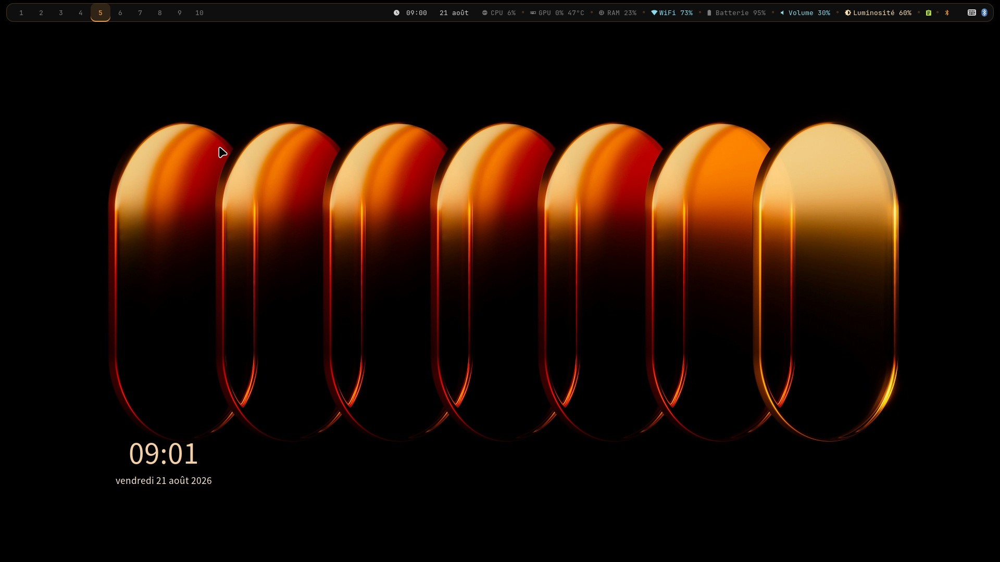
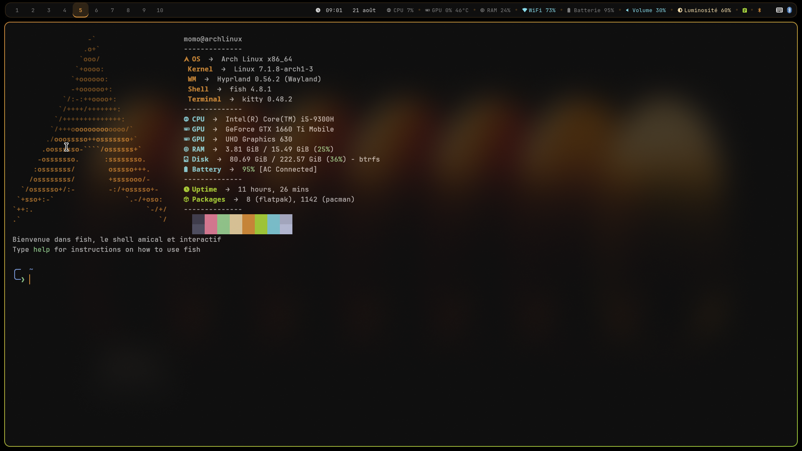
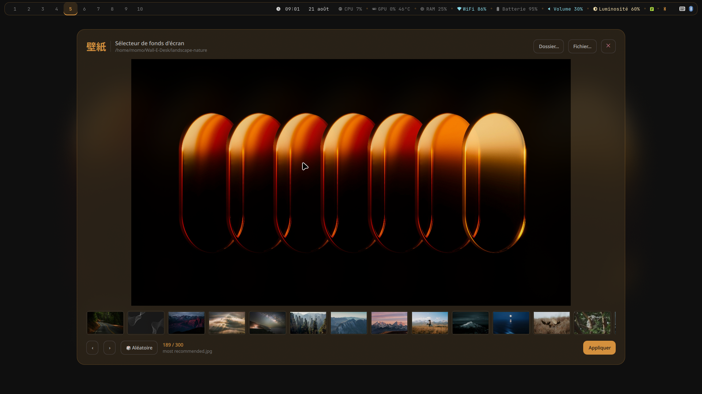
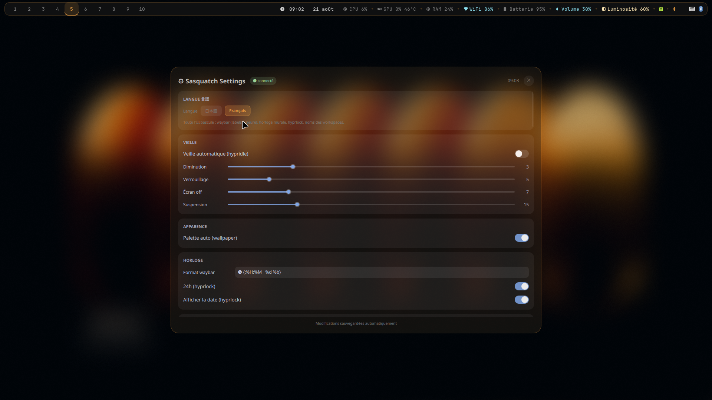

### 🇯🇵 Immersion japonaise

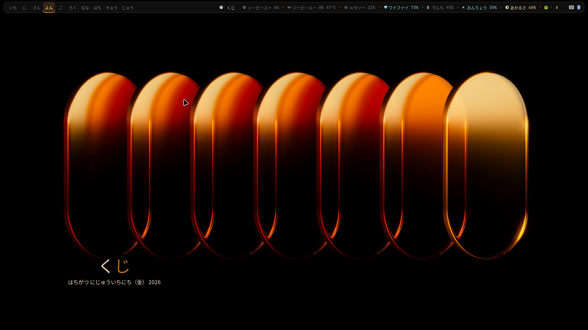
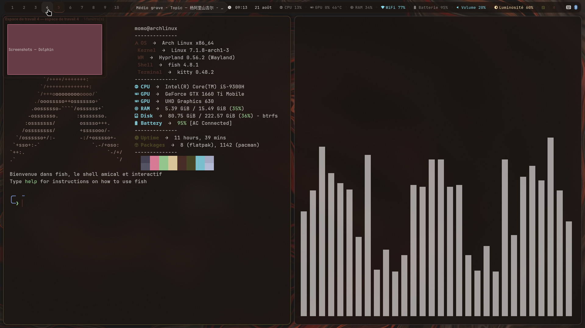

### 🛠️ Widgets & outils

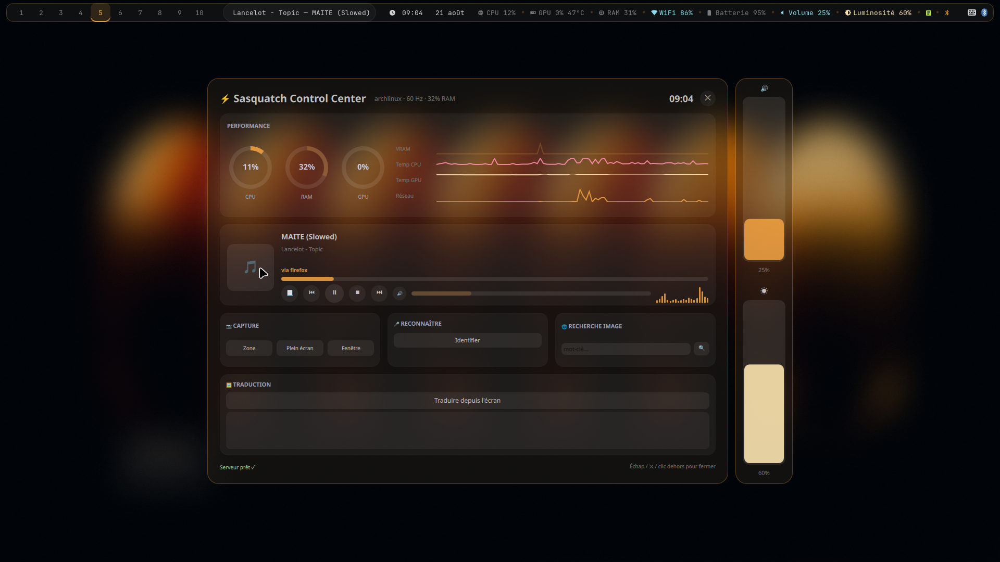
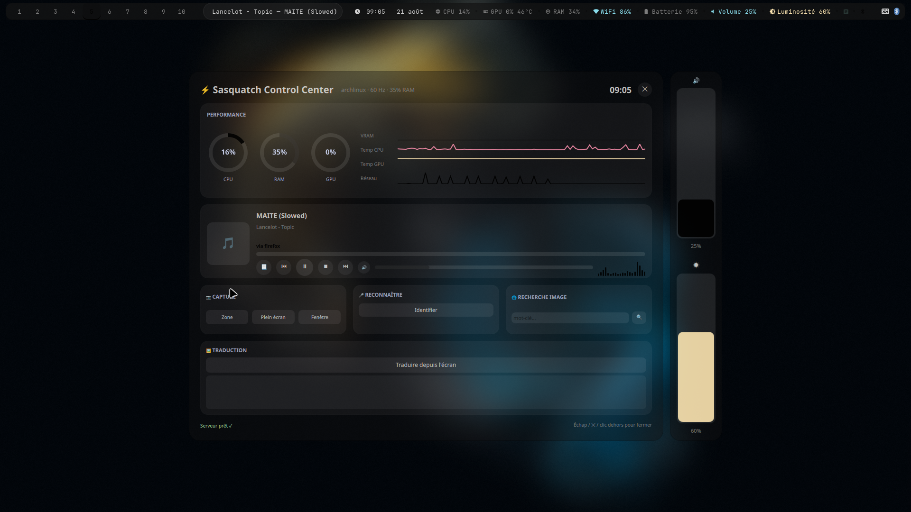
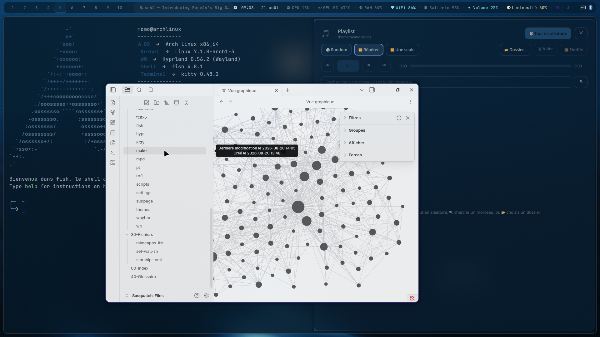
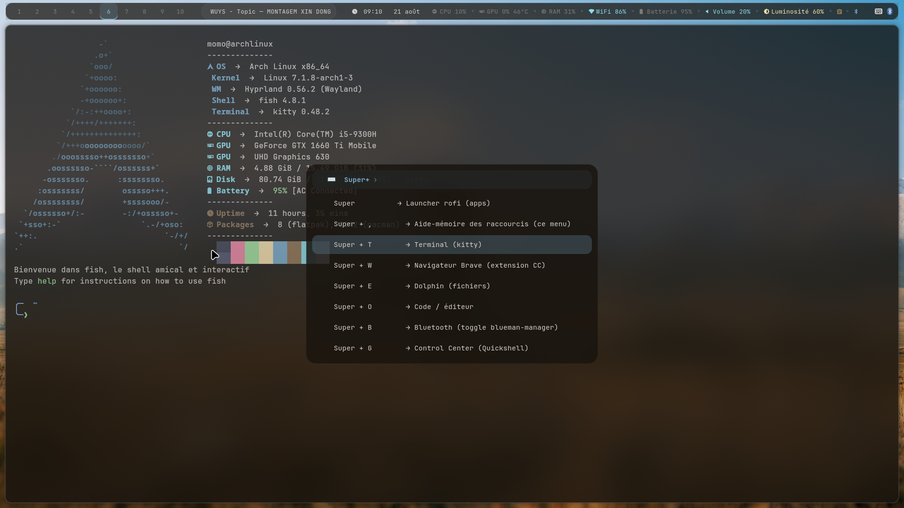

---

## ✨ Aperçu

| Composant | Outil |
|-----------|-------|
| Compositeur | Hyprland |
| Barre | Waybar (🇯🇵 100 % japonais, FR toggle) |
| Launcher / OSD | Rofi |
| Notifications | Mako |
| IME japonais | Fcitx5 + Mozc (`Ctrl+Shift+1`) |
| Terminal / Shell / Prompt | Kitty / Fish / Starship |
| Fond d'écran | Picker `wp/` (Quickshell, `Super+Y`) + hyprpaper |
| Verrouillage / Inactivité | Hyprlock (🇯🇵 hiragana + musique) / Hypridle |
| Sysinfo | Fastfetch |
| Control Center | Quickshell `cc/` (`Super+G`) |
| Panneau Settings | Quickshell `settings/` (`Super+I`) |
| Sidebar chat IA | Quickshell + llama.cpp `aiko/` (`Super+N`) |
| Playlist MPD | Quickshell `pl/` (`Super+P`) |
| Tablette graphique | OpenTabletDriver (service user) |

---

## ⌨️ Raccourcis clavier (AZERTY)

Source de vérité : `hypr/keybinds.conf` (éditable via Settings → RACCOURCIS).

| Touche | Action |
|--------|--------|
| **Super** (seule) | Launcher rofi (toggle) |
| **Super + ,** | Aide-mémoire des raccourcis (toggle) |
| **Super + T / W / E / O** | Terminal / Brave / Dolphin / VS Code |
| **Super + G / I / N** | Control Center / Settings / Sidebar Aiko |
| **Super + C / V** | Calculatrice rofi (qalc) / Presse-papier (cliphist) |
| **Super + B** | Bluetooth (blueman, wrapper anti-crash) |
| **Super + L / Escape** | Verrouiller / Powermenu |
| **Super + Q / Shift+M** | Fermer la fenêtre / Quitter la session |
| **Super + F / D** | Fullscreen / Agrandir |
| **Super + P / Shift+P** | Playlist MPD / Pseudo-tiling |
| **Super + R** | Toggle split |
| **Super + J** | Masquer/afficher la waybar |
| **Super + Shift+V** | Libre/flottant |
| **Super + S / Alt+S** | Scratchpad : toggle / envoyer dedans |
| **Super + H** | Obsidian (toggle, float) |
| **Super + Z / Shift+Z / Ctrl+Z** | Focus / déplacer / resize (Z,S,Q,D = haut,bas,gauche,droite) |
| **Super + 1..5 / Shift+1..5** | Workspace / déplacer vers workspace |
| **Super + ←/→ / molette** | Workspace précédent/suivant (boucle 1↔10) |
| **Super + Y** | Sélecteur de fonds d'écran (thème dynamique) |
| **Ctrl+Shift+1** | Bascule IME japonais |
| **XF86Audio\*** / **XF86MonBrightness\*** | Volume / luminosité + OSD |
| **Print / Super+Print** | Screenshot plein écran / zone |

---

## 🚀 Installation

```bash
git clone https://github.com/MLD229/Sasquatch-Dotfile.git
cd Sasquatch-Dotfile
bash install.sh
```

Redémarre ta session après l'installation.

<details>
<summary>⚠️ Réseau (machine neuve)</summary>

`install.sh` active `systemd-networkd` + `iwd`, mais il faut un fichier
`/etc/systemd/network/*.network` pour obtenir une IP. Exemple WiFi minimal :

```ini
# /etc/systemd/network/20-wlan.network
[Match]
Name=wlan0
[Network]
DHCP=yes
```

Sans ça : `iwctl station wlan0 connect <SSID>` associe le WiFi mais aucune IP n'est attribuée.
</details>

---

## 📦 Dépendances

```bash
# Officiel (pacman)
sudo pacman -S hyprland hyprlock hypridle hyprpaper \
xdg-desktop-portal-hyprland xdg-utils xdg-user-dirs \
waybar mako rofi \
python-gobject gtk-layer-shell python-pillow python-numpy python-cairo \
kitty fish starship fastfetch \
ttf-jetbrains-mono-nerd \
noto-fonts noto-fonts-emoji noto-fonts-cjk \
brightnessctl playerctl \
pipewire pipewire-pulse wireplumber \
qt5-wayland qt6-wayland libnotify \
iwd bluez bluez-utils blueman \
polkit-gnome wl-clipboard cliphist \
grim slurp jq \
dolphin pavucontrol firefox \
papirus-icon-theme kvantum qt5ct \
eza bat neovim code mpv \
nvidia-utils libva-nvidia-driver \
fcitx5 fcitx5-mozc fcitx5-configtool fcitx5-gtk fcitx5-qt \
libqalculate \
mpd mpc cava alsa-utils songrec quickshell curl ffmpeg zenity \
tesseract tesseract-data-fra

# AUR (via yay — install.sh le fait automatiquement)
yay -S brave-bin catppuccin-gtk-theme-mocha bibata-cursor-theme \
opentabletdriver llama.cpp-cuda
```

> Liste exhaustive : `requirements` (source de vérité, synchro avec install.sh).

---

## 📁 Structure

```
Sasquatch-Dotfile/
├── aiko/          ← Sidebar 愛子 — chat IA locale + vision (Super+N)
│                   backend Python stdlib (8780) + llama-server CUDA (8781, lazy)
├── cc/            ← Control Center (Super+G) : dashboard perf, now-playing,
│                   Shazam, screenshot ; service user permanent `sasquatch-cc`
├── fastfetch/     ← logo + palette dynamique (bloc SASQUATCH-PALETTE)
├── fcitx5/        ← IME japonais (bascule Ctrl+Shift+1)
├── fish/          ← config.fish (alias, MPD_HOST socket user)
├── hypr/          ← hyprland.conf → conf.d/, keybinds.conf, hypridle/hyprlock/
│                   hyprpaper.conf + scripts (autostart, lock-ja, media-ctl…)
├── install.sh     ← installateur (symlinks + paquets + services)
├── kitty/ mako/   ← thèmes (bloc SASQUATCH-PALETTE)
├── mpd/           ← lecteur local, socket user + fifo CC Capture
├── pl/            ← Playlist MPD (Super+P) : random/repeat/single, recherche
├── rofi/          ← themes/ (sasquatch, osd, colors) + scripts (launcher, powermenu)
├── scripts/       ← theme-apply, volume, brightness, screenshot, calc, clipboard…
├── settings/      ← Panneau Settings (Super+I) : veille, apparence, horloge,
│                   raccourcis, système — sauvegarde auto
├── starship.toml
├── themes/        ← GTK (Catppuccin/Papirus) + Qt (Papirus-Dark)
├── waybar/        ← config 🇯🇵 japonais + style (palette) + scripts (clock-ja,
│                   wallclock-ja, fastview) ; service systemd user
└── wp/            ← Sélecteur de fonds d'écran (Super+Y) : grille + 🎲 aléatoire
```

---

## 🎨 Thème dynamique

Le fond d'écran pilote les couleurs de **toute** l'interface : waybar, kitty,
bordures Hyprland, hyprlock, mako, rofi, CC, settings, fastfetch.

- `scripts/theme-apply.py` extrait la palette (PIL) — fond sombre teinté, texte
  clair, accent = couleur vive du fond, accent2 = complémentaire.
- `scripts/theme-apply.sh` orchestre (verrou `flock`, rechargement waybar sans flash).
- Zones retintées entre markers `SASQUATCH-PALETTE-BEGIN/END` dans 8 fichiers.
- **Hook auto** : `~/.config/waypaper/config.ini` →
  `post_command = ~/.config/scripts/theme-apply.sh $wallpaper`
- Manuelle : `./set-wall.sh <image>` change le wallpaper ET applique le thème.

---

## 🇯🇵 Immersion japonaise

Interface en **hiragana** (kanji/katakana rarement), tooltips = épellation (yomi) + traduction française.

- **Waybar 100 % japonais** : labels courts + tooltips complets (`waybar/ui-ja.json`).
- **Heure en hiragana** : `clock-ja.py` (じゅうにじ さんじゅうごふん), `wallclock-ja.py`
  (horloge flottante dans le wallpaper, position + couleur auto).
- **Workspaces japonais** : `いち..じゅう` renommés à chaud (FR/EN possible).
- **Hyprlock japonais** : heure + date hiragana + now-playing MPD.
- Bascule FR/JA : toggle dans le waybar.

---

## 🛠️ Modules Quickshell

### 🎛️ Control Center — `Super+G`

Dashboard temps réel : CPU/RAM/GPU/VRAM/températures/réseau, now-playing MPD
(pochette, seek, contrôles), **égaliseur cava synchronisé** sur la sortie audio
réelle, **Music Finder** (8 s de capture PipeWire → Shazam via songrec),
screenshot (zone/plein écran/fenêtre). Backend Python 100 % stdlib, service
systemd user permanent (`sasquatch-cc`, logs : `journalctl --user -u sasquatch-cc`).

### ⚙️ Panneau Settings — `Super+I`

Sections : **VEILLE** (timeouts hypridle), **APPARENCE** (palette auto/manuelle),
**HORLOGE** (format waybar + hyprlock), **RACCOURCIS** (57 binds éditables →
overrides dans `keybinds-user.conf`), **CONTROL PANEL**, **SYSTÈME** (gaps,
rounding, animations). Sauvegarde automatique dans `settings/settings.json`.

### 🤖 Sidebar 愛子 Aiko — `Super+N`

Chat IA **locale** avec vision : llama-server (llama.cpp CUDA) + Qwen2.5-VL-3B
GGUF, backend stdlib (SSE), capture de zone → vision, historique autosave.
Lazy : ne tourne que si la sidebar est ouverte. Setup : `aiko/setup.sh`.

### 🎵 Playlist MPD — `Super+P`

Toggles random/repeat/single, liste cliquable, recherche/ajout, dossier musique.
MPD isolé par utilisateur (socket unix, pas de port TCP partagé).

---

## 🌙 Veille / suspend (NVIDIA)

Gel GPU au réveil corrigé par `scripts/fix-suspend.sh` (à lancer en `sudo`) :
`nvidia_drm.modeset=1` (GRUB), `NVreg_PreserveVideoMemoryAllocations=1`
(modprobe) et services `nvidia-suspend` / `nvidia-resume` / `nvidia-hibernate`.
